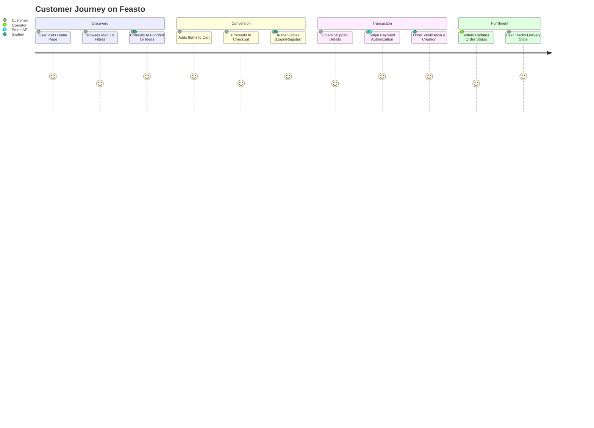
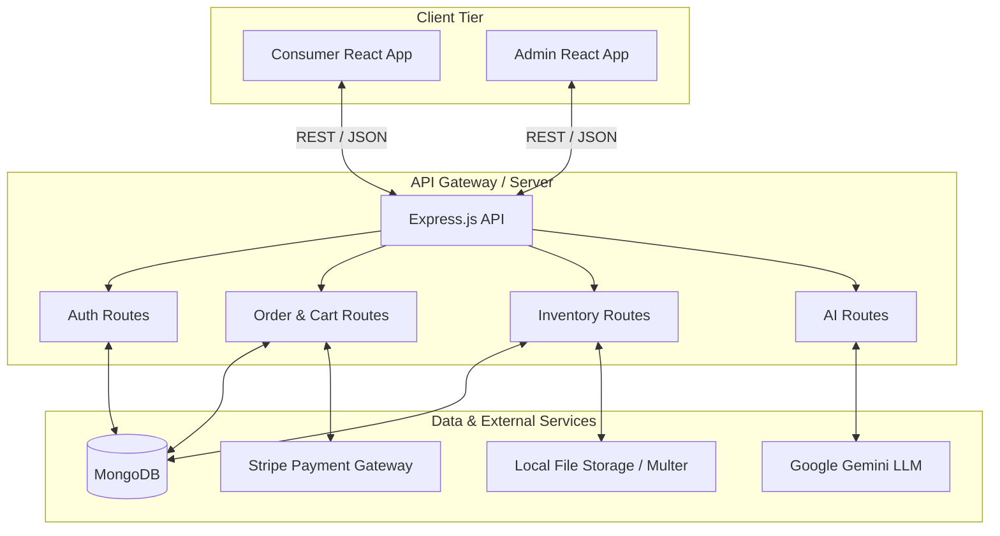

<div align="center">


</div>


<p align="center">
  <strong>A Premium Full-Stack Food Delivery & Management Ecosystem Powered by AI</strong>
</p>


<div align="center">
  

</div>

<div align="center">

  [](https://www.mongodb.com/mern-stack)
  [](https://react.dev/)
  [](https://stripe.com/)
  [](https://deepmind.google/technologies/gemini/)

  [](#license)
  [](#changelog)
  [](#contributing)

</div>

<p align="center">
  <em>Revolutionizing the dining experience through intelligent recommendations, robust transaction pipelines, and decoupled architecture.</em>
</p>

---

## 🌟 Why This Project Matters

In an increasingly saturated food delivery market, both consumers and restaurant operators face significant friction. Consumers suffer from decision fatigue and generic recommendations, while operators struggle with fragmented inventory and order orchestration systems. 

**Feasto** bridges this critical market gap. By introducing an **AI-driven personalization engine** (via Google Gemini) into the consumer flow and a real-time, highly decoupled administrative dashboard for operators, Feasto elevates the standard delivery model into an intelligent ecosystem. 

For the business, it represents **scalable operations** and **transactional integrity** backed by Stripe. For the end-user, it represents a curated, seamless, and highly responsive journey from cravings to doorstep delivery. This architecture forms a robust foundation capable of scaling into a multi-tenant SaaS application.

---

## 🚀 Feature Showcase

### 🤖 Intelligent AI Personalization
- **AI Foodbot:** Integrated Google Gemini LLM processes user preferences to generate personalized recipes, meal suggestions, and nutritional insights.
- **Dynamic Context:** Eliminates decision fatigue by providing users with smart culinary recommendations directly in the interface.

### 💳 Enterprise-Grade Transaction Pipeline
- **Stripe Payment Intents:** Ensures PCI-compliant, secure checkout flows.
- **Transactional Integrity:** Server-side validation of cart items, pricing, and order states before authorizing any payment to prevent data tampering.
- **Robust Verification:** Webhook-ready asynchronous payment verification (`/api/order/verify`) ensures orders only proceed upon successful fund capture.

### 🍱 Seamless Customer Experience
- **Reactive UI/UX:** Built with React 19 and Vite for instant load times and optimistic UI updates.
- **Persistent Cart Engine:** Complex state management handles cart aggregations, dynamic delivery fee calculations, and cross-session persistence.
- **Real-Time Order Tracking:** Complete lifecycle visibility from "Food Processing" to "Out for Delivery" to "Delivered".

### 🛡️ Unified Administrative Dashboard
- **Decoupled Admin Client:** A separate, secure portal ensuring operations don't interfere with consumer traffic.
- **Full Inventory Orchestration:** Streamlined CRUD interfaces for menu management, including robust multipart/form-data processing for high-quality food imagery via Multer.
- **Order Lifecycle Management:** Centralized hub for operators to mutate order statuses and track operational throughput.

---

## 🖼️ Project Screenshots

<p align="center">
  
  <br/><br/>
  
  <br/><br/>
  
  <br/><br/>
  
</p>

---

## 🗺️ Interactive Product Walkthrough



---

## 💎 Technical Excellence

### Architecture & Design Patterns
- **Decoupled Monorepo Structure:** Separation of concerns is enforced at the repository level with isolated `client`, `admin`, and `server` environments.
- **MVC Backend Architecture:** Express.js routing is strictly separated into Models (Mongoose), Views (JSON payloads), and Controllers (Business Logic) for maximum maintainability.
- **Stateless Authentication:** Implements secure JWT (JSON Web Tokens) with Bcrypt hashing, ensuring scalable, session-less authentication across both client and admin portals.

### Performance & Scalability
- **Optimized Asset Delivery:** React Vite bundler provides lightning-fast HMR during development and heavily optimized, minified chunks for production.
- **Efficient Image Handling:** Multer middleware processes and serves static assets efficiently, laying the groundwork for future CDN integration.

### Security Implementations
- **CORS Policies:** Strictly configured Cross-Origin Resource Sharing.
- **Payload Validation:** Validator.js enforces strict input sanitation to prevent injection attacks.
- **Environment Isolation:** Sensitive keys (Stripe, Gemini, JWT secrets) are heavily decoupled via `dotenv`.

---

## 🧩 Technology Ecosystem

<details>
<summary><strong>Frontend Stack (Client & Admin)</strong></summary>

*   **React 19:** Next-generation UI library for concurrent rendering.
*   **Vite:** Ultra-fast native ESM frontend tooling.
*   **React Router 7:** Advanced routing with nested layouts and data loading.
*   **Axios:** Promise-based HTTP client for robust API communication.
*   **Vanilla CSS:** Highly optimized, scoped custom stylesheets without framework bloat.
</details>

<details>
<summary><strong>Backend Stack (Server)</strong></summary>

*   **Node.js & Express 5:** High-performance asynchronous runtime and web framework.
*   **MongoDB & Mongoose:** NoSQL database with strict schema validation.
*   **Google Gemini SDK (`@google/genai`):** Next-gen LLM integration.
*   **Stripe SDK:** Enterprise payment processing.
*   **Multer:** Multipart/form-data parsing for media uploads.
*   **Bcrypt & JWT:** Cryptography and secure token exchange.
</details>

---

## 🏗️ Architecture & System Design



---

## 🏆 Key Achievements & Engineering Highlights

1. **Integrated Generative AI in E-Commerce:** Successfully engineered a bridge between an e-commerce workflow and an LLM, dynamically parsing user prompts to provide culinary context, effectively increasing user engagement time.
2. **Robust Payment State Machine:** Designed a fault-tolerant checkout pipeline where the frontend cart state, backend order validation, and Stripe Webhook/Verification endpoints maintain atomic consistency, preventing revenue leakage or ghost orders.
3. **Advanced State Synchronization:** Implemented complex React Context strategies to synchronize the global cart state with local storage and backend database states seamlessly.

---

## 📊 Project Metrics

> *Metrics placeholders for post-deployment benchmarking.*

| Metric | Target | Current Benchmark |
| :--- | :--- | :--- |
| **Lighthouse Performance** | 90+ | *[To be measured]* |
| **API Response Time** | < 200ms | *[To be measured]* |
| **Test Coverage** | 80%+ | *[To be measured]* |
| **Bundle Size (Client)** | < 300KB | *[To be measured]* |

---

## 💻 Installation & Local Development

### Prerequisites
- **Node.js** (v18.0.0 or higher)
- **MongoDB** (Local instance or Atlas URI)
- **Stripe Account** (For Secret Key)
- **Google Cloud Console Account** (For Gemini API Key)

### 1. Clone the Repository
```bash
git clone https://github.com/SarthakDudhe/Feasto-Food-Delivery-Platform.git
cd Feasto-Food-Delivery-Platform
```

### 2. Environment Configuration
Create a `.env` file in the `server/` directory:
```env
PORT=4000
MONGO_URI=mongodb+srv://<user>:<password>@cluster.mongodb.net/feasto
JWT_SECRET=your_super_secret_jwt_key
STRIPE_SECRET_KEY=sk_test_your_stripe_key
GEMINI_API_KEY=AIzaSy_your_gemini_key
```

### 3. Install & Run the Server
```bash
cd server
npm install
npm run server # Runs with nodemon on http://localhost:4000
```

### 4. Install & Run the Consumer Client
```bash
cd ../client
npm install
npm run dev # Runs on http://localhost:5173
```

### 5. Install & Run the Admin Portal
```bash
cd ../admin
npm install
npm run dev # Runs on http://localhost:5174
```

---

## 📂 Folder Structure Overview

```text
Feasto-Food-Delivery-Platform/
├── admin/                 # React Admin Dashboard
│   ├── src/
│   │   ├── components/    # Reusable UI (Sidebar, Navbar)
│   │   └── pages/         # Core views (Add, List, Orders)
├── client/                # React Consumer Web App
│   ├── src/
│   │   ├── components/    # Reusable UI (Cart, LoginPopup, FoodDisplay)
│   │   └── pages/         # Core views (Home, PlaceOrder, Foodbot)
└── server/                # Express.js REST API
    ├── configs/           # DB connection setup
    ├── controllers/       # Business logic (auth, orders, ai)
    ├── middleware/        # JWT auth verification
    ├── models/            # Mongoose schemas (User, Food, Order)
    ├── routes/            # API endpoints mapping
    ├── uploads/           # Static image storage
    └── server.js          # Application entry point
```

---

## 🔮 Roadmap & Future Enhancements

- [ ] **Infrastructure Scaling:** Migrate image storage from local Multer to AWS S3/Cloudinary for horizontal scaling.
- [ ] **Real-Time WebSockets:** Implement Socket.io for live driver tracking and instant order status updates without polling.
- [ ] **OAuth 2.0 Integration:** Add Google and GitHub SSO for frictionless user onboarding.
- [ ] **Advanced Analytics Dashboard:** Integrate Recharts in the admin panel for visualizing daily revenue, popular items, and user retention cohorts.

---

## 🤝 Contribution Guidelines

We welcome contributions from the community! To contribute:
1. Fork the repository.
2. Create a feature branch: `git checkout -b feature/amazing-feature`
3. Commit your changes: `git commit -m 'Add amazing feature'`
4. Push to the branch: `git push origin feature/amazing-feature`
5. Open a Pull Request.

---

## 📜 License

This project is licensed under the MIT License - see the [LICENSE](LICENSE) file for details.

---

## 📬 Contact & Author

**Sarthak Dudhe**  
*Full Stack Software Engineer | AI Integration Specialist*

[](https://www.linkedin.com/in/sarthak-dudhe/)
[](https://github.com/SarthakDudhe)
[](#)

<div align="center">
  <br />
  <em>If you found this project interesting or helpful, please consider giving it a ⭐ on GitHub!</em>
</div>
