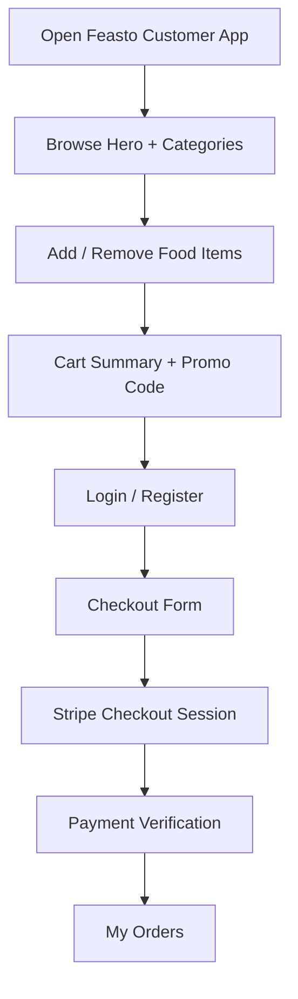
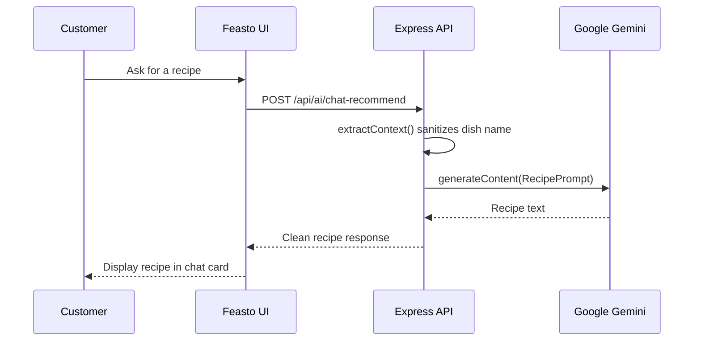
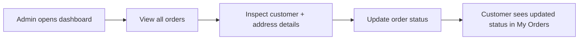
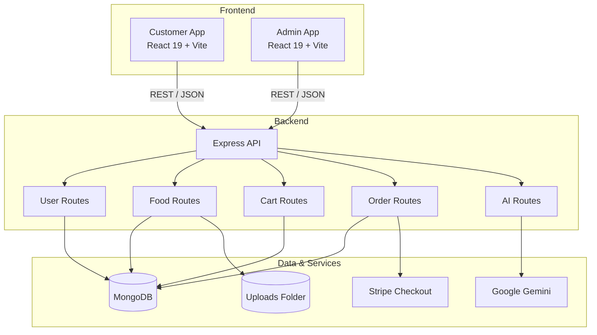
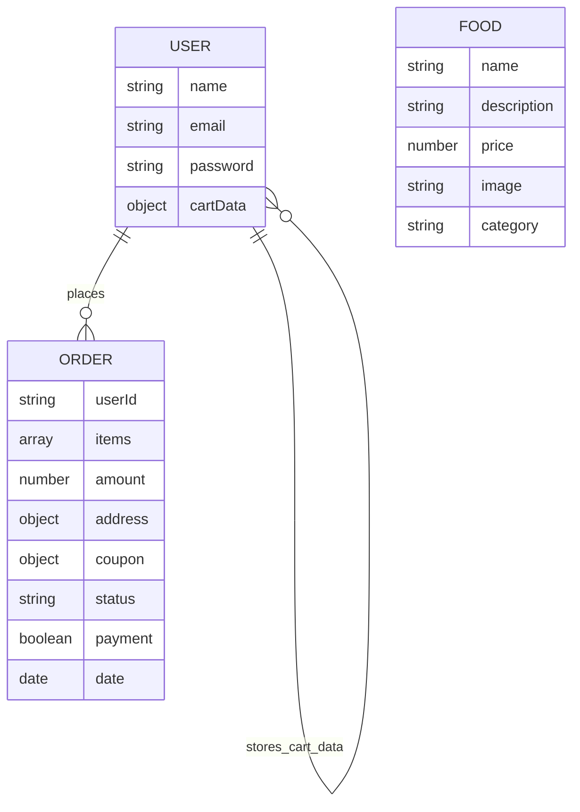

<div align="center">


<br /><br />


<p><strong>Premium food ordering, AI recipe assistance, and admin operations in one full-stack monorepo.</strong></p>

<p>
  A warm, polished, recruiter-friendly food delivery platform built with a customer app, an admin panel,
  and a Node.js backend that handles authentication, carts, coupons, Stripe checkout, order verification,
  image uploads, and Gemini-powered recipe generation.
</p>

<p>
  
  
  
  
  
  
  
  
  
</p>

<p>
  <a href="#live-demo--deployment-status">Live demo placeholder</a> •
  <a href="#product-walkthrough">Product walkthrough</a> •
  <a href="#architecture">Architecture</a> •
  <a href="#getting-started">Getting started</a> •
  <a href="#api-reference">API reference</a>
</p>

</div>

---

## Live Demo & Deployment Status

> Replace these placeholders with your actual deployed URLs when you publish the project.

| Surface | Placeholder URL | Notes |
| --- | --- | --- |
| Customer app | `https://your-customer-demo.example` | Customer ordering experience |
| Admin app | `https://your-admin-demo.example` | Operational management console |
| Backend API | `https://feasto-backend-e0ic.onrender.com` | Current backend URL referenced in the code |

---

## What Feasto Does

### Customer Experience

- browse a curated food catalog
- filter by category using the explore menu
- add / remove items from the cart
- persist cart state for authenticated users
- apply promo codes:
  - `WELCOME20`
  - `FEASTO10`
  - `SAVE5`
- see subtotal, discount, delivery fee, and final total
- sign up or log in with JWT authentication
- place an order through Stripe Checkout
- verify payment status after redirect
- view personal order history
- use the Gemini-powered **Feasto AI** recipe assistant

### Admin Experience

- add new menu items with image upload
- manage food inventory
- view all menu items in a table layout
- remove dishes from the catalog
- review all incoming orders
- update order status:
  - `Food Processing`
  - `Out for delivery`
  - `Delivered`

### Backend & Platform Logic

- hash passwords with `bcrypt`
- issue JWT tokens for authenticated users
- protect cart and order endpoints with JWT middleware
- serve uploaded food images from `/images`
- calculate coupon discounts with thresholds and caps
- create Stripe Checkout sessions dynamically
- verify order payment outcomes
- generate AI recipes with Google Gemini
- sanitize AI inputs to extract the actual dish name

---

## Visual Asset Placeholders

Use these placeholders if you want to turn the README into a more visual product page later.

| Visual | Recommended Size | What Should Be Shown |
| --- | --- | --- |
| Hero banner | `1600 × 600` | A premium Feasto banner with the current warm red / cream UI language |
| Customer home screenshot | `1440 × 900` | Homepage hero, promo carousel, menu browser, and food cards |
| Cart screen | `1440 × 900` | Cart table, promo code block, totals panel, checkout CTA |
| Checkout screen | `1440 × 1100` | Delivery form, totals summary, and payment CTA |
| AI assistant | `900 × 1200` | Gemini recipe assistant panel and sample recipe output |
| Admin dashboard | `1440 × 900` | Navbar, sidebar, and premium control panel layout |
| Add item form | `1440 × 1100` | Image upload, fields, category selector, and save action |
| Menu list table | `1440 × 900` | Food inventory table with delete actions |
| Orders page | `1440 × 1100` | Incoming orders, address details, and status dropdowns |
| Architecture diagram | `1600 × 900` | Monorepo flow and backend integrations |

---

## Product Walkthrough

### Customer Journey



### AI Recipe Flow



### Admin Order Workflow



---

## Architecture

### High-Level System View



### Data Model Overview



---

## Technical Excellence

### What the codebase does well

#### 1) Clear monorepo separation
- `client/` handles customer-facing commerce
- `admin/` handles operational management
- `server/` exposes shared API endpoints

This separation makes the system easier to reason about, extend, and deploy independently.

#### 2) Context-driven cart architecture
- `StoreContext` centralizes:
  - food list loading
  - cart state
  - coupon application
  - final total calculation
  - auth token hydration
- Authenticated carts sync to the backend
- Anonymous cart updates still work in the UI state

#### 3) Coupon system with real business rules
- coupon codes are validated against a curated list
- thresholds prevent low-value misuse
- discounts have caps where needed
- the coupon auto-clears if the cart total drops below the minimum

#### 4) JWT-based auth flow
- login and register endpoints issue signed tokens
- `authMiddleware` reads the token from request headers
- the middleware injects `userId` into the body for protected flows

#### 5) Stripe Checkout integration
- checkout sessions are created server-side
- order items and delivery fee are converted into Stripe line items
- success and cancel redirects point back to the verification route
- discounted orders generate Stripe coupon objects when applicable

#### 6) Gemini-backed AI recipe assistant
- user input is sanitized before calling Gemini
- the assistant generates a single recipe for the requested dish
- invalid input is rejected instead of generating noisy output

#### 7) Image upload and catalog management
- admin item creation uses `multer`
- uploaded images are stored in the server `uploads/` directory
- removing a food item also deletes the corresponding file from disk

#### 8) Premium customer/admin UI layer
- responsive UI across the customer and admin apps
- warm premium visual system
- reusable panel, card, and form styling patterns
- promo carousel-inspired content treatment across multiple screens

---

## Technology Ecosystem

<table>
  <tr>
    <th>Layer</th>
    <th>Tools & Libraries</th>
  </tr>
  <tr>
    <td><strong>Customer Frontend</strong></td>
    <td>React 19, React Router DOM 7, Vite, Axios, Vanilla CSS</td>
  </tr>
  <tr>
    <td><strong>Admin Frontend</strong></td>
    <td>React 19, React Router DOM 7, Vite, Axios, React Toastify, Vanilla CSS</td>
  </tr>
  <tr>
    <td><strong>Backend</strong></td>
    <td>Node.js, Express 5, MongoDB, Mongoose, JWT, bcrypt, validator, multer, body-parser, cors</td>
  </tr>
  <tr>
    <td><strong>Commerce</strong></td>
    <td>Stripe Checkout Sessions</td>
  </tr>
  <tr>
    <td><strong>AI</strong></td>
    <td>Google Gemini via <code>@google/genai</code></td>
  </tr>
  <tr>
    <td><strong>Dev Tooling</strong></td>
    <td>ESLint, Vite build pipeline, Nodemon for server development</td>
  </tr>
  <tr>
    <td><strong>Deployment Assumptions</strong></td>
    <td>Backend referenced on Render; admin contains Vercel-compatible config; local frontend dev via Vite</td>
  </tr>
</table>

---

## Getting Started

### Prerequisites

- Node.js 18+ recommended
- npm 9+ or newer
- MongoDB Atlas or local MongoDB
- Stripe account for checkout
- Google AI API key for the recipe assistant

### Environment Variables

#### Server (`server/.env`)

```env
PORT=4000
MONGODB_URI=mongodb+srv://<username>:<password>@cluster.mongodb.net
JWT_SECRET=your_jwt_secret_key
STRIPE_SECRET_KEY=sk_test_your_stripe_key
GEMINI_API_KEY=your_gemini_api_key
```

> **Important:** the backend code uses `MONGODB_URI` (not `MONGO_URI`).

#### Frontend API base URLs

The current code uses hardcoded backend URLs. If you are running locally against `http://localhost:4000`, update these files:

- `client/src/context/StoreContext.jsx`
- `client/src/pages/Foodbot/Foodbot.jsx`
- `admin/src/assets/assets.js`
- `server/controllers/orderController.js` (Stripe success/cancel redirect domain)

### Local Development Workflow

<details>
<summary><strong>1) Clone the repository</strong></summary>

```bash
git clone https://github.com/<your-username>/Feasto-Food-Delivery-Platform.git
cd Feasto-Food-Delivery-Platform
```

</details>

<details>
<summary><strong>2) Install and run the backend</strong></summary>

```bash
cd server
npm install
npm run server
```

The backend runs on `http://localhost:4000` by default if `PORT=4000`.

</details>

<details>
<summary><strong>3) Install and run the customer app</strong></summary>

```bash
cd ../client
npm install
npm run dev
```

The customer app runs on Vite's local dev server, usually `http://localhost:5173`.

</details>

<details>
<summary><strong>4) Install and run the admin app</strong></summary>

```bash
cd ../admin
npm install
npm run dev
```

The admin app runs on a separate Vite dev server, usually `http://localhost:5174`.

</details>

### Production Build Checks

```bash
# Customer app
cd client
npm run build

# Admin app
cd ../admin
npm run build
```

> There is **no Dockerfile** in the repository at the moment.  
> There is also **no automated CI pipeline** committed yet.

---

## API Reference

### Authentication

| Method | Endpoint | Auth | Description |
| --- | --- | --- | --- |
| `POST` | `/api/user/register` | No | Register a new customer and return a JWT |
| `POST` | `/api/user/login` | No | Login an existing customer and return a JWT |

### Food Catalog

| Method | Endpoint | Auth | Description |
| --- | --- | --- | --- |
| `POST` | `/api/food/add` | Admin / no route guard currently | Upload a food item with image and metadata |
| `GET` | `/api/food/list` | No | List all food items |
| `POST` | `/api/food/remove` | No route guard currently | Remove a food item and delete its image file |

### Cart

| Method | Endpoint | Auth | Description |
| --- | --- | --- | --- |
| `POST` | `/api/cart/add` | Yes | Increase item quantity in the user cart |
| `POST` | `/api/cart/remove` | Yes | Decrease item quantity in the user cart |
| `POST` | `/api/cart/get` | Yes | Fetch the saved cart for the current user |

### Orders

| Method | Endpoint | Auth | Description |
| --- | --- | --- | --- |
| `POST` | `/api/order/place` | Yes | Create a Stripe Checkout session and persist the order |
| `POST` | `/api/order/verify` | No | Confirm payment result and mark order as paid or remove it |
| `POST` | `/api/order/userOrders` | Yes | Fetch the authenticated user's orders |
| `GET` | `/api/order/list` | No | Fetch all orders for the admin panel |
| `POST` | `/api/order/status` | No | Update order status from the admin panel |

### AI Assistant

| Method | Endpoint | Auth | Description |
| --- | --- | --- | --- |
| `POST` | `/api/ai/chat-recommend` | No | Generate a Gemini recipe response for the requested dish |

---

## Database Schema

### `User`

| Field | Type | Notes |
| --- | --- | --- |
| `name` | `String` | Required |
| `email` | `String` | Required, unique |
| `password` | `String` | Stored as bcrypt hash |
| `cartData` | `Object` | Default `{}` and persisted in MongoDB |

### `Food`

| Field | Type | Notes |
| --- | --- | --- |
| `name` | `String` | Required |
| `description` | `String` | Required |
| `price` | `Number` | Required |
| `image` | `String` | Required; filename stored in uploads folder |
| `category` | `String` | Required |

### `Order`

| Field | Type | Notes |
| --- | --- | --- |
| `userId` | `String` | Required |
| `items` | `Array` | Food items with quantities |
| `amount` | `Number` | Final order amount |
| `address` | `Object` | Delivery information |
| `coupon` | `Object` | Optional applied coupon metadata |
| `status` | `String` | Default: `Food Processing` |
| `date` | `Date` | Default: `Date.now()` |
| `payment` | `Boolean` | Default: `false` |

---

## Folder Structure

```text
Feasto-Food-Delivery-Platform/
├── client/                     # Customer-facing React app
│   └── src/
│       ├── components/         # Navbar, Footer, Food cards, Login popup, etc.
│       ├── context/            # StoreContext (cart, coupon, auth, food list)
│       ├── pages/              # Home, Cart, PlaceOrder, MyOrder, Verify, Foodbot
│       └── assets/             # Shared customer assets and menu data
├── admin/                      # Admin React app
│   └── src/
│       ├── components/         # Admin Navbar, Sidebar
│       ├── pages/              # Add, List, Orders
│       └── assets/             # Admin images and asset map
├── server/                     # Express + MongoDB API
│   ├── configs/                # Database connection
│   ├── controllers/            # Auth, food, cart, order, AI logic
│   ├── middleware/             # JWT auth middleware
│   ├── models/                 # Mongoose schemas
│   ├── prompt/                 # Gemini prompt template for recipes
│   ├── routes/                 # API route definitions
│   ├── uploads/                # Food images saved by multer
│   └── utils/                  # Coupons, token helper, prompt sanitization
└── README.md                   # This document
```

---

## Security Considerations

Feasto already includes several practical security-minded decisions:

- **bcrypt password hashing** before storing user passwords
- **JWT authentication** for protected cart and order routes
- **validator.js email validation** during registration
- **input sanitization** for the AI recipe assistant
- **route-level middleware** that injects `userId` into protected requests
- **environment variables** for sensitive secrets

### Known security gaps to address next

- the admin food CRUD endpoints are not yet protected by a dedicated admin auth layer
- frontend auth token is stored in `localStorage`, which is convenient but less secure than HttpOnly cookies
- Stripe webhook verification is not implemented; order confirmation currently relies on redirect verification

---

## Testing Strategy

### Current state

- manual QA through the customer and admin UIs
- production build verification using Vite
- endpoint validation through the browser and API flow

### Recommended next steps

- add unit tests for coupon logic
- add API tests for auth, cart, order, and AI routes
- add component tests for checkout and admin order management
- add integration tests for Stripe verification flow

---

## Roadmap

- [ ] protect admin routes with a dedicated role-based auth layer
- [ ] move frontend API base URLs into environment variables
- [ ] add webhook-based Stripe payment confirmation
- [ ] add automated tests for API and UI flows
- [ ] add analytics cards to the admin dashboard
- [ ] add cloud image storage (Cloudinary / S3)
- [ ] introduce live order updates with WebSockets
- [ ] add searchable and sortable admin tables
- [ ] add a richer recipe assistant experience with suggestion history

---

## Contributing

Contributions are welcome.

1. Fork the repository
2. Create a feature branch
3. Commit your changes with a clear message
4. Push to your branch
5. Open a pull request

### Suggested contribution areas

- admin authentication
- automated tests
- API environment configuration
- analytics UI
- cloud storage for food images
- order tracking improvements
- accessibility improvements

---

## Acknowledgments

Feasto uses and benefits from excellent open-source tooling and services:

- React
- Vite
- Express
- MongoDB / Mongoose
- Stripe
- Google Gemini
- Multer
- Axios
- React Router
- React Toastify

Special thanks to the open-source ecosystem that makes full-stack product work fast and expressive.

---

## License

No root-level `LICENSE` file is currently committed to the repository.

If you plan to publish Feasto publicly, add a license file at the project root and update this section accordingly.

---

## Contact

> Replace these placeholders with your actual profile links before publishing.

- **GitHub:** [Your GitHub profile](https://github.com/)
- **LinkedIn:** [Your LinkedIn profile](https://www.linkedin.com/)
- **Portfolio:** [Your portfolio website](https://your-portfolio.example)
- **Email:** `you@example.com`

<div align="center">

### Feasto is designed to feel like a product, not just a project.

If you want, I can also generate a matching **admin README**, a **one-page architecture doc**, or a **short recruiter-friendly project summary** for your portfolio.

</div>
